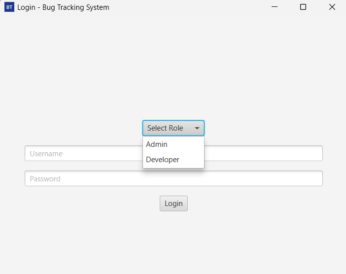
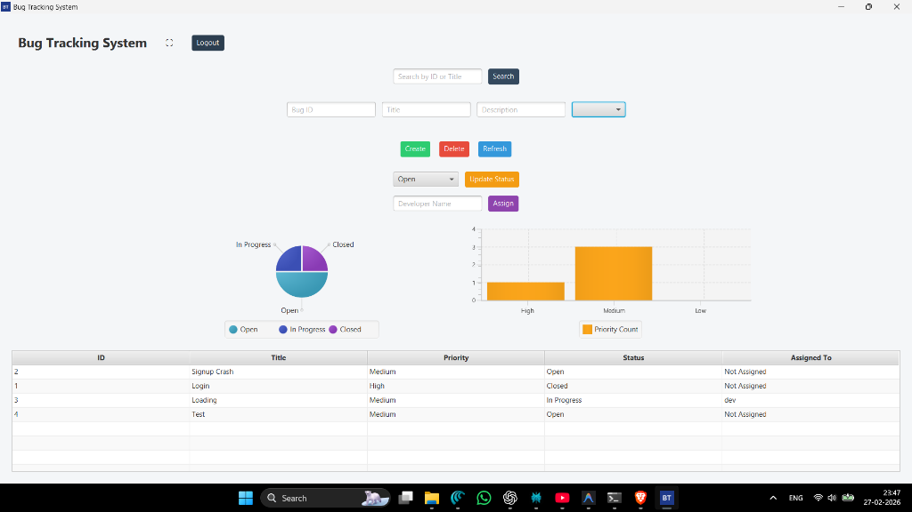
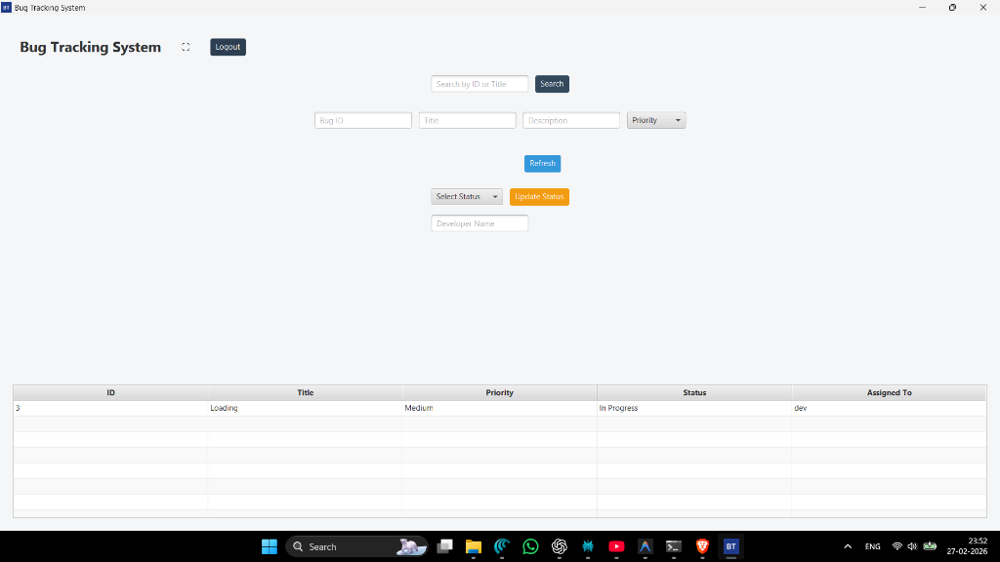

# Enterprise Bug Tracking System (JavaFX Desktop Application)

## Overview

This is a role-based desktop Bug Tracking System built using Java and JavaFX.  
The application simulates a real-world internal issue management system used in software teams.

It supports secure login, role-based access control, analytics dashboard, persistent storage, and smooth UI interactions.

This project demonstrates structured architecture, object-oriented design, and desktop application development using Maven.

---

## Key Features

- Role-Based Login (Admin / Developer)
- Admin Dashboard with Full Control
- Developer Restricted View
- Bug Creation and Assignment
- Status Management (Open / In Progress / Closed)
- Analytics Dashboard (Pie Chart & Bar Chart)
- Persistent File Storage
- Smooth UI Animations
- Fullscreen Support
- Executable JAR Packaging

---

## Role System

### Admin
- Can create, delete, assign bugs
- Can update status
- Can view analytics dashboard
- Can see all bugs

### Developer
- Can view only assigned bugs
- Can update status of assigned bugs
- Cannot create or delete bugs
- No access to analytics dashboard

---

## Technologies Used

- Java 25
- JavaFX
- Maven
- Object-Oriented Programming
- File Handling
- JavaFX Charts
- Clean Layered Architecture (Model / Service / UI)

---

## Project Structure

```text
BugTrackingSystem
├── pom.xml
├── README.md
├── bugs.txt
└── src
    └── main
        ├── java
        │   ├── model
        │   ├── service
        │   └── ui
        └── resources
```

---

## How To Run

### Using Maven

```bash
mvn clean javafx:run
```

### Using Executable JAR

```bash
mvn clean package
java -jar target/BugTrackingSystem-1.0-SNAPSHOT.jar
```

---

## Screenshots

### Login Screen


### Admin Dashboard


### Developer Dashboard


---

## Architecture Approach

This application follows a layered architecture:

- Model Layer → Data structure (Bug, User)
- Service Layer → Business logic (BugService, AuthService)
- UI Layer → JavaFX interface (LoginView, MainApp)

This separation ensures scalability, maintainability, and clean code structure.

---

## Author

Aditya  
Computer Science Student  
Focused on Desktop Application Development and System Design